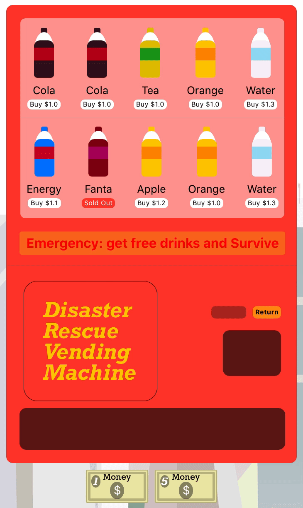

# Disaster Rescue Vending Machine

This Swift playground is called “Disaster Rescue Vending Machine”. This vending machine could be used as typical vending machines, but in the case of a power outage due to an event of disaster, the vending machine could temporarily serve as an infrastructure for serving free beverages until the lifeline is restored. 

